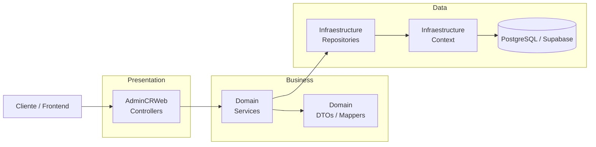
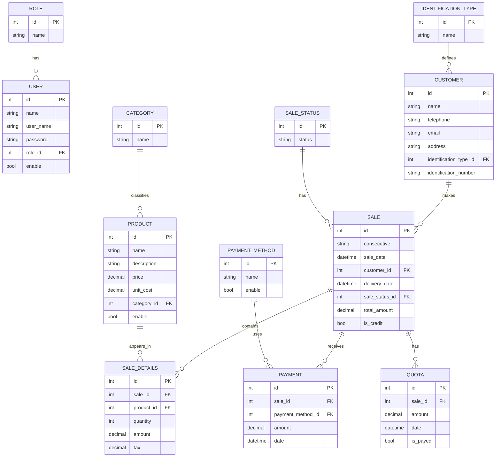

# AdminCR_Backend

Backend de administración para gestión de ventas, clientes, productos y pagos, desarrollado con ASP.NET Core y PostgreSQL/Supabase.

## Arquitectura general

La solución sigue una estructura orientada por capas para separar responsabilidades:

- AdminCRWeb: capa de presentación con controladores y punto de entrada de la API.
- Domain: lógica de negocio, servicios, DTOs y configuración de dependencias.
- Infraestructure: acceso a datos, repositorios, contexto de EF Core y entidades.



## Flujo de ejecución

1. El cliente consume los endpoints expuestos por la API.
2. Los controladores reciben la solicitud y la envían a los servicios del dominio.
3. Los servicios aplican la lógica de negocio y usan repositorios.
4. Los repositorios interactúan con Entity Framework Core y la base de datos PostgreSQL/Supabase.

## Relación principal de entidades



## Capa por capa

### AdminCRWeb
Contiene los endpoints HTTP y la configuración inicial de la aplicación. Aquí se registran servicios y se habilita la autenticación/autorización.

### Domain
Incluye:

- Servicios de negocio
- DTOs
- AutoMapper
- Registro de dependencias

### Infraestructure
Incluye:

- `Context` de EF Core
- entidades del dominio persistente
- repositorios para acceso a datos

## Reglas de negocio principales

- Los usuarios tienen roles para controlar accesos como Administrador y Vendedor.
- Los productos se clasifican por categoría, por ejemplo:
  - Colchones
  - Basecamas
  - Accesorios de cama
- Cada venta pertenece a un cliente y puede tener múltiples detalles, pagos y cuotas.
- El estado de la venta se determina por `sale_status`, con valores como pendiente, entregada o finalizada.
- El modo de pago se identifica por `isCredit`: `true` indica crédito y `false` indica contado.

## Tecnologías principales

- ASP.NET Core
- Entity Framework Core
- PostgreSQL / Supabase
- AutoMapper

## Siguientes pasos recomendados

- Mantener la conexión de la API en la variable de entorno `DB__ACCESS` con una cadena Npgsql válida, usando el pooler de Supabase en entornos como Codespaces.
- Validar la app con el comando local confirmado:

```bash
cd /workspaces/AdminCR_Backend
export DB__ACCESS='Host=aws-0-us-east-2.pooler.supabase.com;Port=6543;Database=postgres;Username=postgres.ttqbvnkgyiiqgxowgmte;Password=TU_PASSWORD;SSL Mode=Require;Trust Server Certificate=true;Pooling=true;Timeout=15;Command Timeout=30'
dotnet run --project AdminCRWeb/AdminCRWeb.csproj --urls "http://0.0.0.0:5291;https://0.0.0.0:7291"
```

- Probar el endpoint real para confirmar que la conexión y el esquema coinciden:

```bash
curl -k -sS -i https://localhost:7291/api/User/GetUsers
```

- Revisar y mantener el mapeo de propiedades a columnas PostgreSQL en minúsculas, por ejemplo: `id`, `role_id`, `username`, `enable`.
- Verificar que los catálogos iniciales estén creados y alineados con el esquema de Supabase: `role`, `category`, `identification_type`, `sale_status`, `payment_method`.
- Revisar autenticación, permisos y políticas de acceso para el entorno de Supabase, especialmente si hay tablas protegidas o endpoints que requieren JWT.
- Mantener el README actualizado cada vez que cambie la conexión, el hostname del pooler o las convenciones del esquema.

